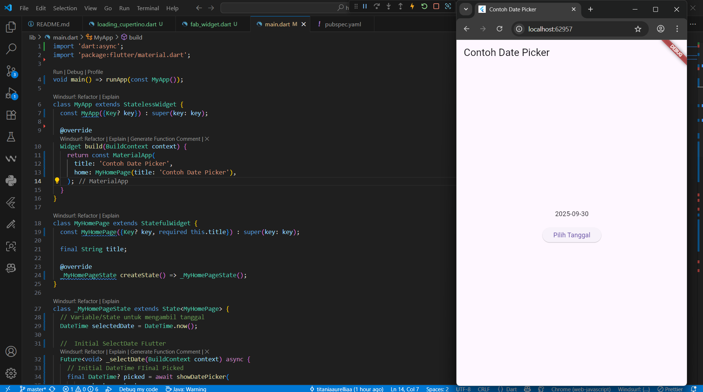
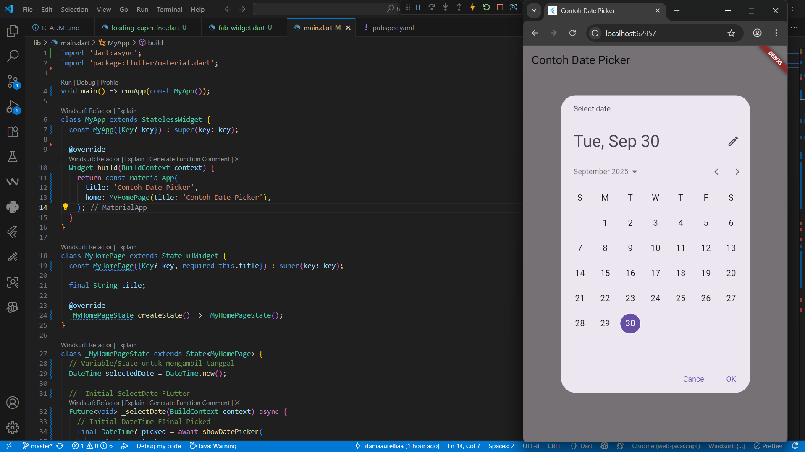

# hello_world

A new Flutter project.

Praktikum Ke-3 Membuat Repository GitHub dan Laporan Praktikum

Praktikum Ke-4 Menerapkan Widget Dasar

Praktikum 5: Menerapkan Widget Material Design dan iOS Cupertino

